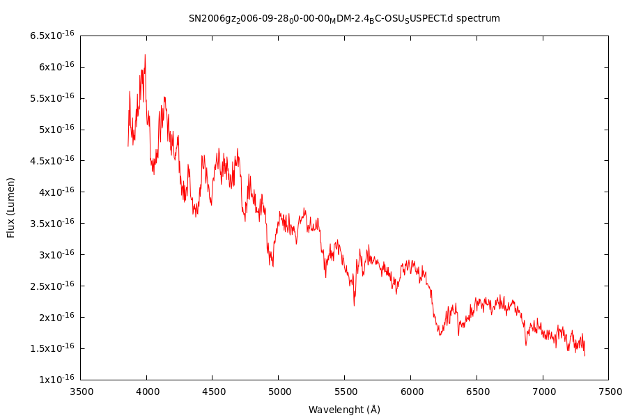
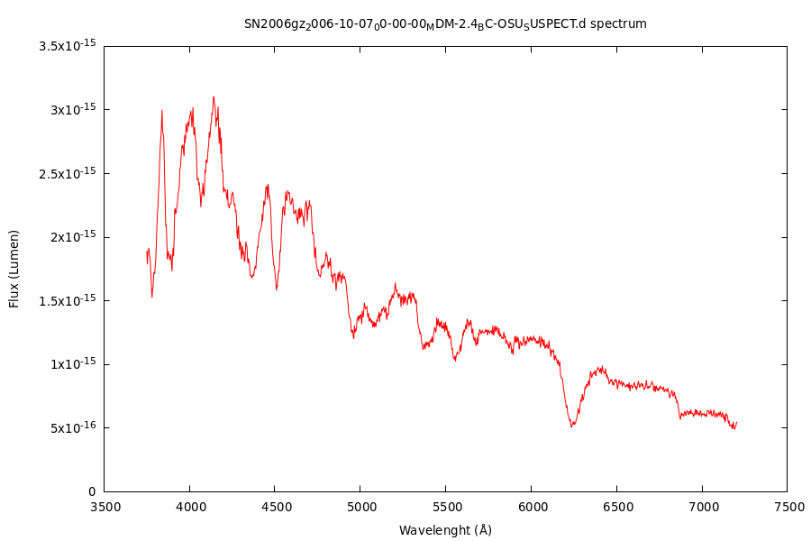
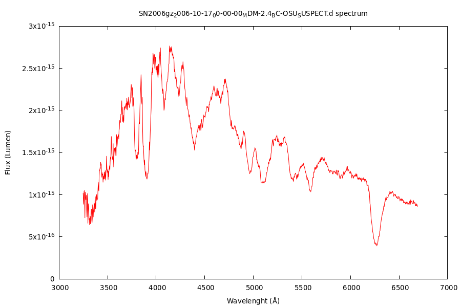
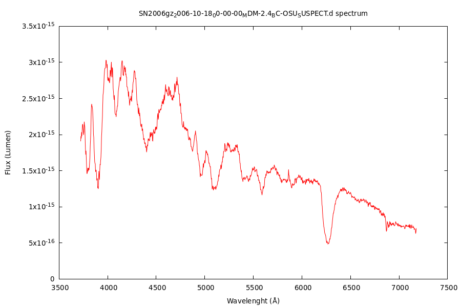
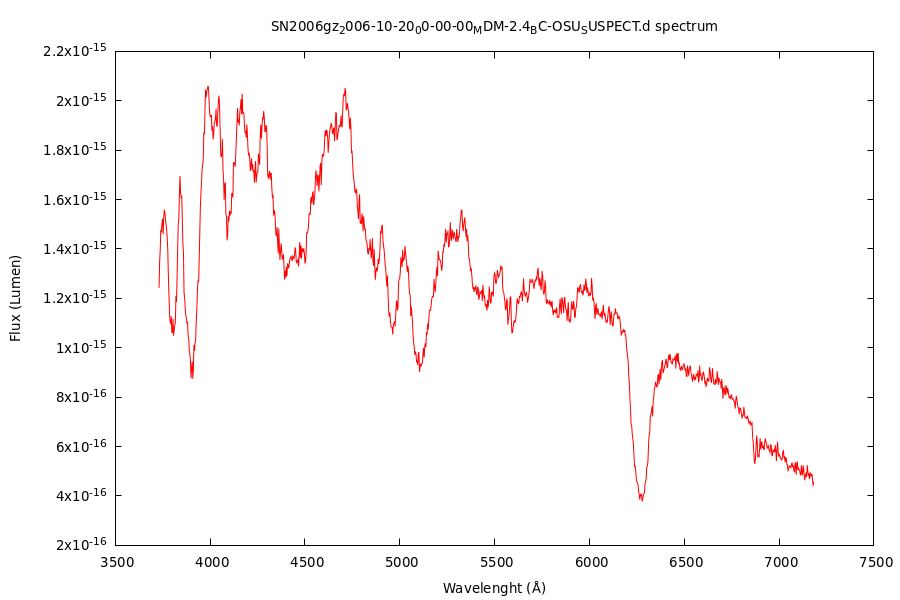

# GNUplot scripts

This is where I'll be posting my plotting scripts. Plotting a graph is probably one of the most repeated tasks in Physics. Knowing how to automate some of the process is crutial in saving some time for more brain-demanding activities.

In my [first script](FolderPlot2.p) I show how to do just that: **plot every data file in a directory** with the specified file extension. Only GNUplot is needed in this script, but it could also be made with **bash** scripting.

Credit goes to [Weijun Zhou](https://unix.stackexchange.com/users/259023/weijun-zhou) and [Otto Hanski](https://unix.stackexchange.com/users/356551/otto-hanski) for contrinuting to such a specific [thread on Stackexchange](https://unix.stackexchange.com/questions/515924/plotting-all-files-from-a-directory-in-gnuplot), from which I took most of the code.

Below several spectra can be seen as output of the script, that read all the **.dat** files in the folder it was placed;

Feel free to use it and improve it!
