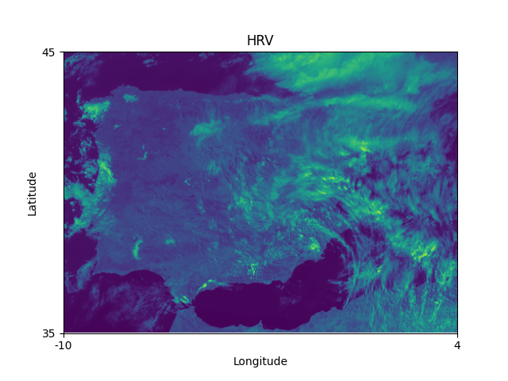
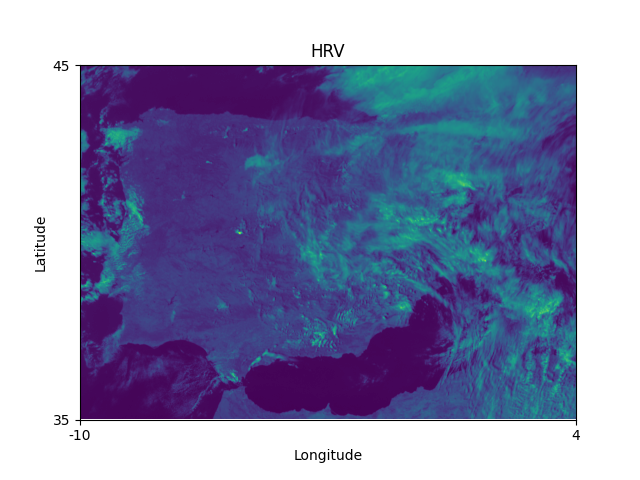
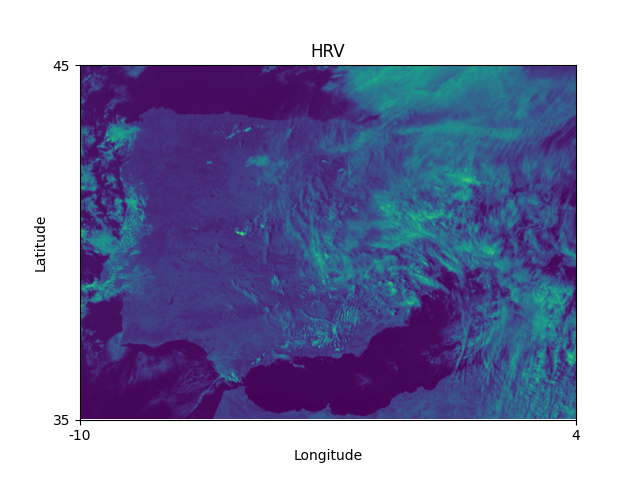
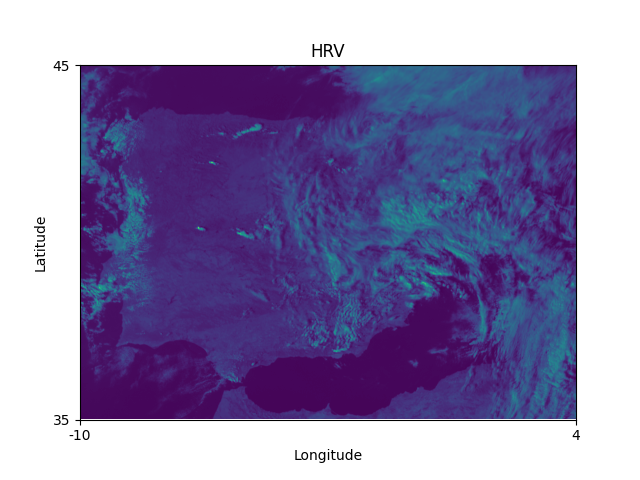
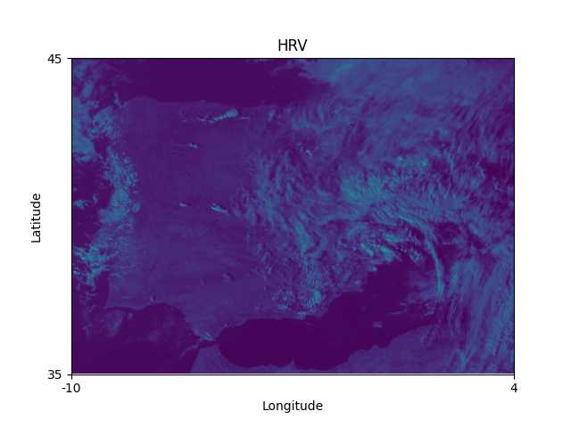

# .nat To .tiff converter

The files with ".nat" extension are the native file format of the Meteosat Geostationary satellites. In order to obtain the newest Meteosat images, I found a script by Mr. [Darius A. Görgen](https://www.dariusgoergen.com/contents/blog/2020-06-14-nat2tif/index.html) and tweaked it to automate the process from selecting the .nat file to all the individual bandwidth outputs.

# Dependencies
This script requires **numpy, osgeo (GDAL), satpy and pyresample** libraries to function. When using Ubuntu 20.04LTS, the GDAL library can be tricky to install correctly, even when using virtual environment tools. Luckily, GitHub user [nvogtvincent](https://github.com/nvogtvincent) provided an [answer](https://github.com/ContinuumIO/anaconda-issues/issues/10351#issuecomment-976661610) that did it for me.

# Output
For monday February 6th starting at at 13:15 UTC

High Resolution Visual (HRV)

